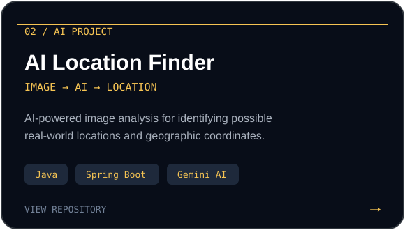

<!-- ===================== CUSTOM ANIMATED HERO ===================== -->

  

<!-- ===================== ABOUT ===================== -->

<h2 align="center">👨‍💻 About Me</h2>

  <b>Full Stack Developer building modern digital products with clean engineering and product thinking.</b>

  I work across frontend, backend, Android, and AI-powered applications —
  transforming real-world requirements into scalable and user-focused software.

  💼 Full Stack Developer
  &nbsp; • &nbsp;
  🎓 B.Tech CSE
  &nbsp; • &nbsp;
  🚀 9+ Projects
  &nbsp; • &nbsp;
  📍 India

 

<!-- ===================== ANIMATED TECH STACK ===================== -->

  

 

<!-- ===================== CURRENT FOCUS ===================== -->

<h2 align="center">⚡ Currently Building & Learning</h2>

  <code>Scalable Backend Systems</code>
  &nbsp; • &nbsp;
  <code>Modern React Applications</code>
  &nbsp; • &nbsp;
  <code>Microservices</code>
  &nbsp; • &nbsp;
  <code>AI Integration</code>
  &nbsp; • &nbsp;
  <code>Clean Architecture</code>

 

<!-- ===================== FEATURED PROJECTS ===================== -->

<h2 align="center">🚀 Featured Work</h2>

  Selected projects across Android, backend, full-stack, and AI-powered applications.

 

  

  

  

  

 

<!-- ===================== PROFESSIONAL JOURNEY ===================== -->

<h2 align="center">💼 Professional Journey</h2>

### 🚀 Full Stack Developer

**Innovative DigiTech Services Pvt. Ltd.**

`December 2025 — Present`

Building recruitment and job-search platform features with:

`Java` • `React` • `Spring Boot` • `Hibernate` • `REST APIs`

---

### 💻 Trainee Engineer

**Evision Technoserve Pvt. Ltd.**

Worked on responsive frontend interfaces, API integrations,
and real-world product features.

`React` • `JavaScript` • `REST APIs`

---

### 📱 App Developer

**Anay Group**

Built Android application features with real-time interactions
and Firebase integration.

`Java` • `Android` • `Firebase`

 

<!-- ===================== GITHUB ANALYTICS ===================== -->

<h2 align="center">📊 GitHub Analytics</h2>

  

  

 

<!-- ===================== ACTIVITY GRAPH ===================== -->

<h2 align="center">📈 Contribution Activity</h2>

  

 

<!-- ===================== CONTRIBUTION SNAKE ===================== -->

<h2 align="center">🐍 Contribution Journey</h2>

  <picture>

    <source
      media="(prefers-color-scheme: dark)"
      srcset="https://raw.githubusercontent.com/anandsagar6/anandsagar6/output/github-contribution-grid-snake-dark.svg"
    />

    <source
      media="(prefers-color-scheme: light)"
      srcset="https://raw.githubusercontent.com/anandsagar6/anandsagar6/output/github-contribution-grid-snake.svg"
    />

    

  </picture>

 

<!-- ===================== CONNECT ===================== -->

<h2 align="center">🌐 Let's Connect</h2>

  Open to connecting with developers, teams, and people building interesting products.

  

  

  

  

 

  <b>💡 Building useful products, one commit at a time.</b>

  <i>Code • Learn • Build • Improve • Repeat</i>

