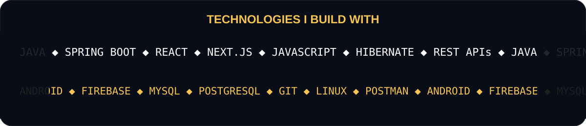
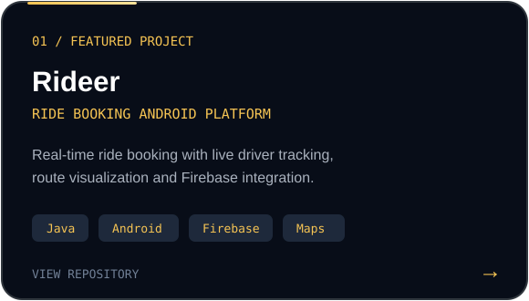
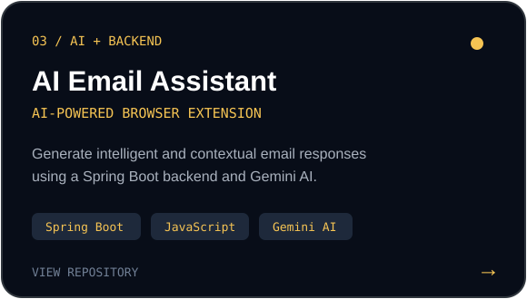
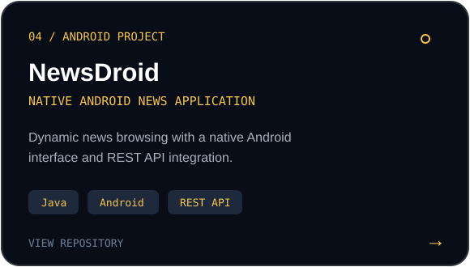

<!-- ANAND SAGAR — GITHUB PROFILE -->

<picture>
  <source media="(prefers-color-scheme: dark)" srcset="./assets/dark.svg">
  <source media="(prefers-color-scheme: light)" srcset="./assets/light.svg">
  
</picture>

<br>

## 👨‍💻 Beyond the Terminal

I build software across the complete product stack — from responsive user interfaces and reusable frontend components to backend services, APIs, databases, Android applications, and real-time systems.

Currently, I work on a **job search and recruitment platform**, contributing across **React.js frontend development and Java backend engineering**.

> **My approach:** Understand the problem → Design the solution → Build cleanly → Ship → Improve

<br>

## ⚡ Technologies I Work With



<br>

## 💼 What I'm Working On

<table>
<tr>
<td width="50%" valign="top">

### ⚛️ Frontend Engineering

- Building responsive interfaces with React.js
- Creating reusable product components
- Integrating frontend applications with REST APIs
- Improving application workflows and user experience

</td>
<td width="50%" valign="top">

### ☕ Backend Engineering

- Working with Java backend services
- Building features with Spring Boot and Hibernate
- Implementing database-driven functionality
- Working with microservice-oriented architecture

</td>
</tr>
</table>

<br>

## 🚀 Featured Projects

### 🚕 Rideer — Ride Booking Platform



A real-time Android ride-booking platform with live driver tracking, route visualization, Firebase-powered updates, ride status management, customer PIN verification, and complete rider/driver workflows.

<br>

### 🤖 Email Assistant Extension



An AI-powered browser extension with a Java and Spring Boot backend, browser-side JavaScript integration, REST communication, and contextual email response generation using Gemini AI.

<br>

### 📰 News Droid



A native Android news application built with Java and XML, focused on a clean and simple mobile news-reading experience.

<br>

## 💼 Professional Journey



<br>

## 🧠 How I Think About Engineering

```java
public class EngineeringMindset {

    public String build(String problem) {
        understand(problem);
        designForMaintainability();
        buildForUsers();
        ship();
        learn();
        improve();

        return "Useful software that can evolve.";
    }
}
```

I care about more than making a feature technically work. I try to understand how it fits into the product, how users interact with it, and how easily the code can evolve later.

<br>

## 🔭 Currently Exploring

<p align="center">

`System Design` &nbsp;•&nbsp;
`Scalable Backend Systems` &nbsp;•&nbsp;
`Microservices` &nbsp;•&nbsp;
`API Design` &nbsp;•&nbsp;
`Real-Time Systems` &nbsp;•&nbsp;
`Applied AI`

</p>

<br>

## 🐍 Contribution Graph

<p align="center">
  <picture>
    <source
      media="(prefers-color-scheme: dark)"
      srcset="https://raw.githubusercontent.com/anandsagar6/anandsagar6/output/github-contribution-grid-snake-dark.svg"
    >
    <source
      media="(prefers-color-scheme: light)"
      srcset="https://raw.githubusercontent.com/anandsagar6/anandsagar6/output/github-contribution-grid-snake.svg"
    >
    
  </picture>
</p>

<br>

<div align="center">

## 🤝 Let's Connect

I'm interested in building useful products, solving meaningful engineering problems, and continuing to grow across the full stack.

<br>

<a href="mailto:anandsagar0006@gmail.com">
  
</a>
<a href="https://www.linkedin.com/in/anandsagar0006/">
  
</a>
<a href="https://leetcode.com/u/anandsagar0006/">
  
</a>
<a href="https://www.codechef.com/users/anandsagar0006">
  
</a>

<br><br>

### `Build → Ship → Learn → Improve`

<sub>Building useful products with clean engineering.</sub>

</div>
